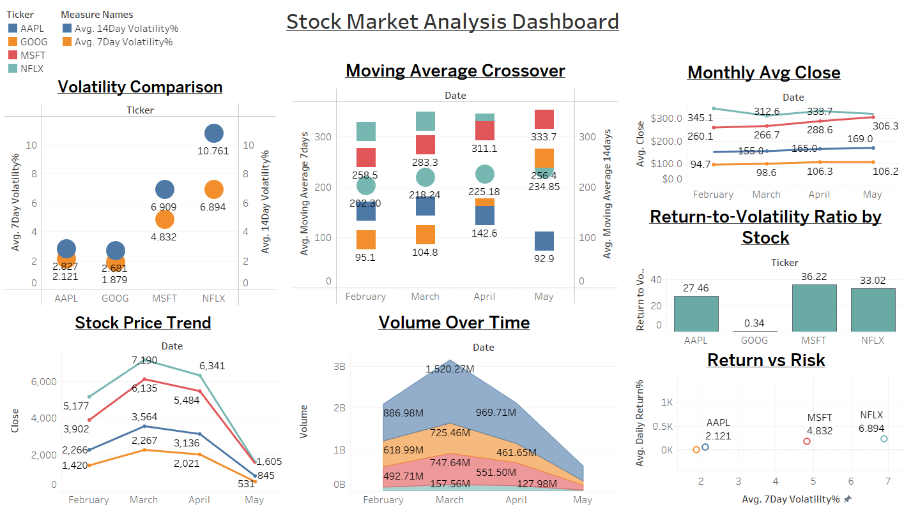
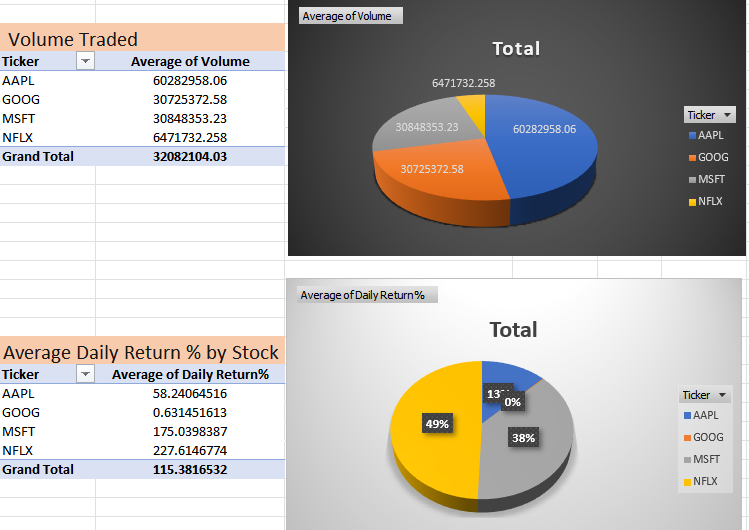
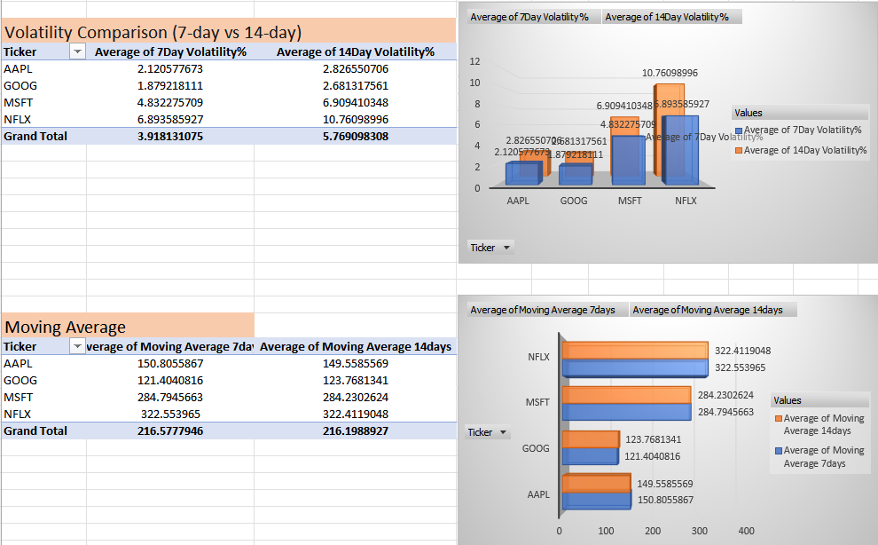
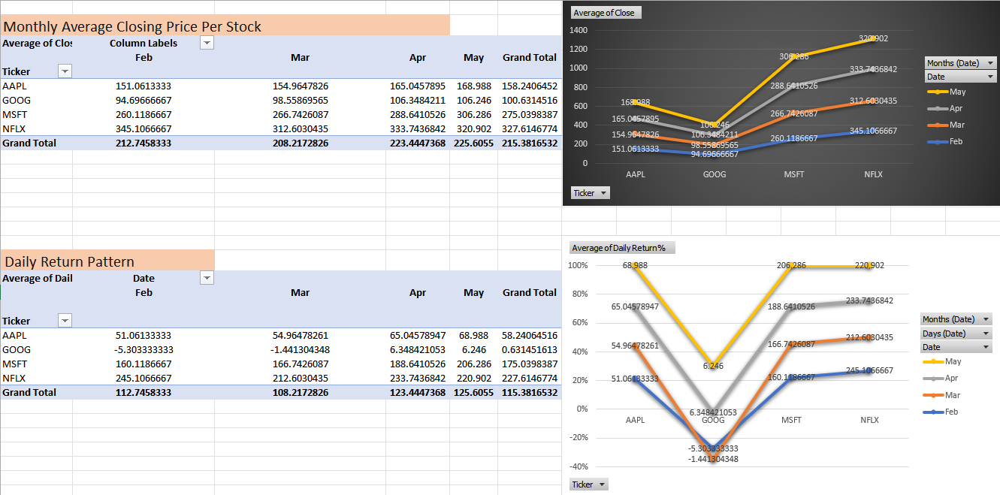

# 📈 Stock Market Analysis

This project analyzes historical stock data for **Apple (AAPL)**, **Microsoft (MSFT)**, **Netflix (NFLX)**, and **Google (GOOGL)** using **Excel**, **SQL**, and **Tableau**. It uncovers patterns in price trends, volatility, and trading volumes through interactive visualizations.

---

## 🎯 Objectives

- Organize and clean daily stock data from multiple companies  
- Identify short-term and long-term trends in closing prices and volumes  
- Compare price movements across companies  
- Build an interactive Tableau dashboard for intuitive analysis  

---

## 🧰 Tools & Technologies

| Tool        | Purpose                                  |
|-------------|------------------------------------------|
| **Excel**   | Data cleaning, formatting, and merging    |
| **SQL**     | Data querying, time-based filtering       |
| **Tableau** | Visual storytelling and dashboard design  |

---

## 📊 Dashboard Preview

## 📸 Additional Visuals & Insights

### 📊 Daily Return Chart

### 📈 Moving Average Comparison

### 📋 Excel Pivot Analysis

<!--
## 📂 Project Presentation

📽️ A downloadable PowerPoint presentation summarizing all key insights and visualizations:

➡️ [Download Supply Chain Dashboard Analysis PPTX](Supply_chain_Dashboard_Analysis.pptx)

➡️ [Download Supply Chain Dashboard Analysis PPTX](Supply%20chain%20Dashboard%20Analysis.pptx)
-->
---

## 📂 Project Presentation

📽️ A downloadable PowerPoint presentation summarizing the stock analysis, key visualizations, and insights:

➡️ [Download Stock Market Analysis PPTX](Stock_Market_Analysis.pptx)

---

## 🔍 Key Insights

- 📉 **Netflix** displayed the highest volatility, especially during Q1 and Q4  
- 📈 **Apple** and **Microsoft** showed consistent growth over the observed period  
- 📊 **Volume spikes** were often linked to major announcements or earnings  
- 🧭 **Google's stock trend** closely tracked broader market indices  

---

## 📂 Project Structure

Stock-Market-Analysis/
│
├── Excel/ # Cleaned stock datasets
├── SQL_Scripts/ # SQL queries for analysis
├── Tableau/ # .twbx Tableau file
├── stock_market_dashboard_preview.png # Dashboard screenshot
└── README.md # Project documentation

yaml
Copy
Edit

---

## 📫 Contact

**Shashank Bajpai**  
📧 [shashankax0@gmail.com]  
🔗 [LinkedIn](www.linkedin.com/in/shashank-bajpai-53871222a)

---

> ⭐ *Feel free to star this repo or connect with me for collaboration and feedback!
